# DrugStore

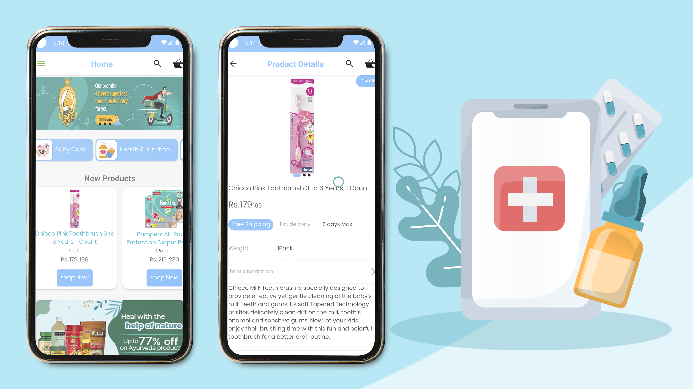

DrugStore - Android app is the client side app for ordering medicines.  
It is free and open source.  
DrugStore for Android is a companion app for [Drugstore Web](https://drugstore.frontendsourcecode.com/).  
DrugStore WebApp is for administration of orders on the admin(DrugStore) side.

## About

With this app, customers can order medicines from the pharmacy it is connected to.
The pharmacy has to host the companion administration web-app [Drugstore Web](https://drugstore.frontendsourcecode.com/).

## Admin Details

[Admin Panel](https://drugstore.frontendsourcecode.com/)

UserName: Admin

Password: Admin@2020

OTP For Android Verification: 000000

## Admin Panel Setup

- Download Xampp 7.4 [Xampp](https://sourceforge.net/projects/xampp/files/XAMPP%20Windows/7.4.33/xampp-windows-x64-7.4.33-0-VC15-installer.exe/download)
- Install Xampp
- Run Xampp Control Panel
- Start Apache & MySql
- Go to http://localhost/phpmyadmin/
- Upload Php Files in to xampp/htdocs folder
- Import Data base from PHP-SourceCode/drugstore.sql
- Update Config File In PHP-SourceCode/admin/includes/config.php & PHP-SourceCode/api/v1/config.php
- Start Your Website http://localhost/yourfoldername
- For Android Integration http://yourvIP4Address/yourfoldername/api/v1/

## Features
The android app lets you:
- Authenticate via phone and password.
- Super simple sign up process with auto verification of OTP.
- Completely ad-free.
- Material Design.
- Specify medicine names.
- Or take picture of prescription and order.
- Realtime update.
- Update minimum order value in realtime.
- Block specific users from ordering.
- Multiple order statuses.
- Push notification to notifiy order status change.

## Screenshots

| Splash | Login | Register |
| ------ | ---- | ------ |
|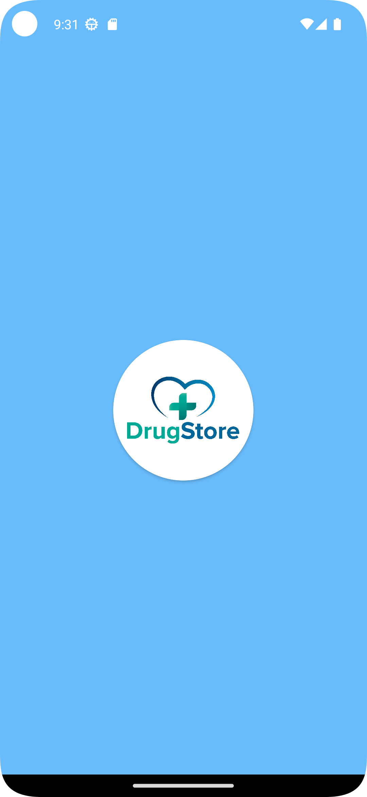|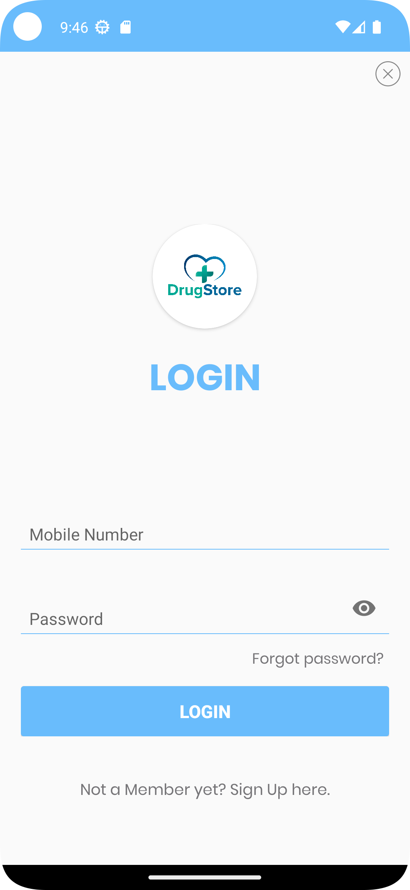|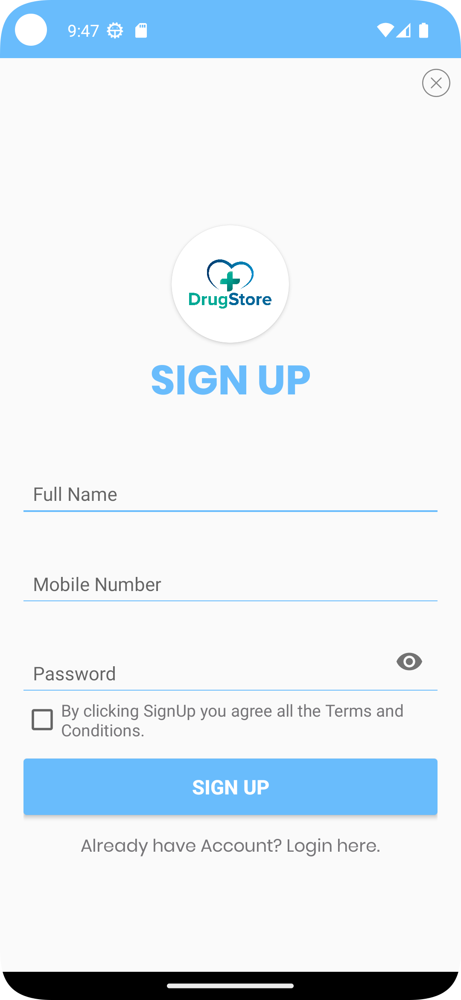|

| Home | Category | Detail |
| ------ | ---- | ------ |
|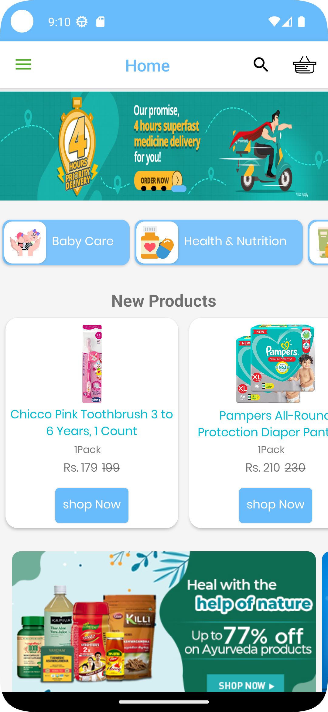|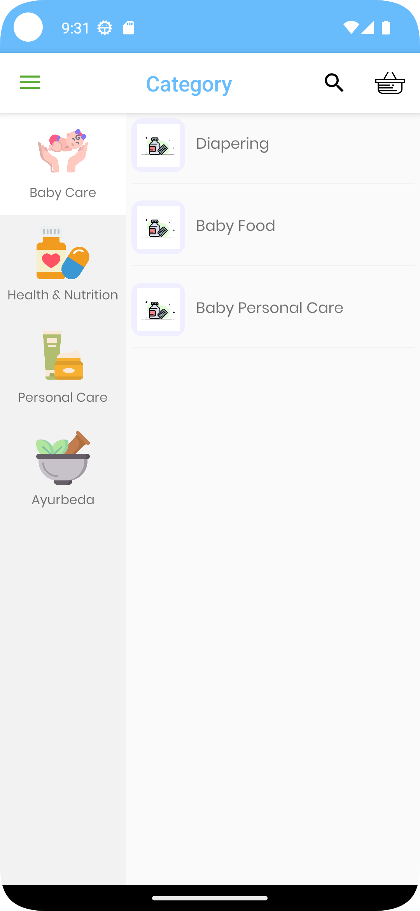|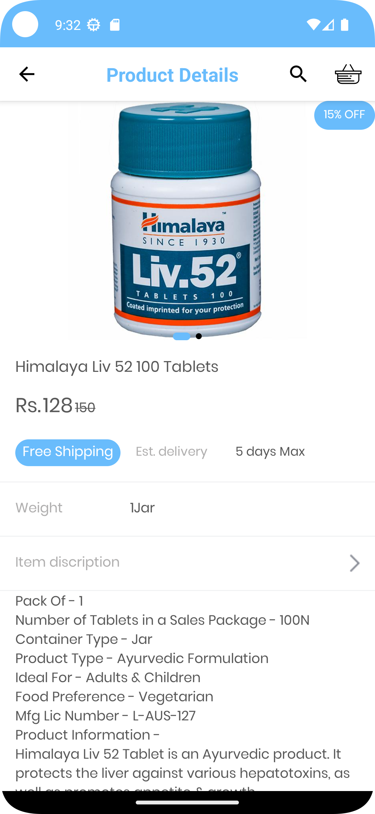|

| Products | Cart | Checkout |
| ------ | ---- | ------ |
|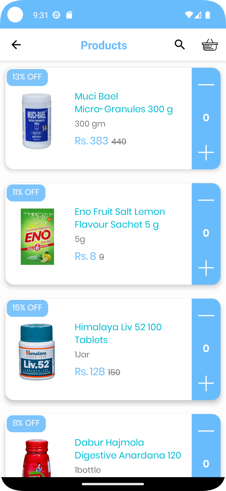|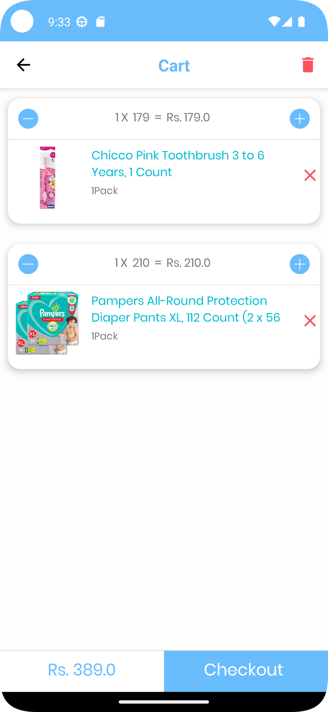|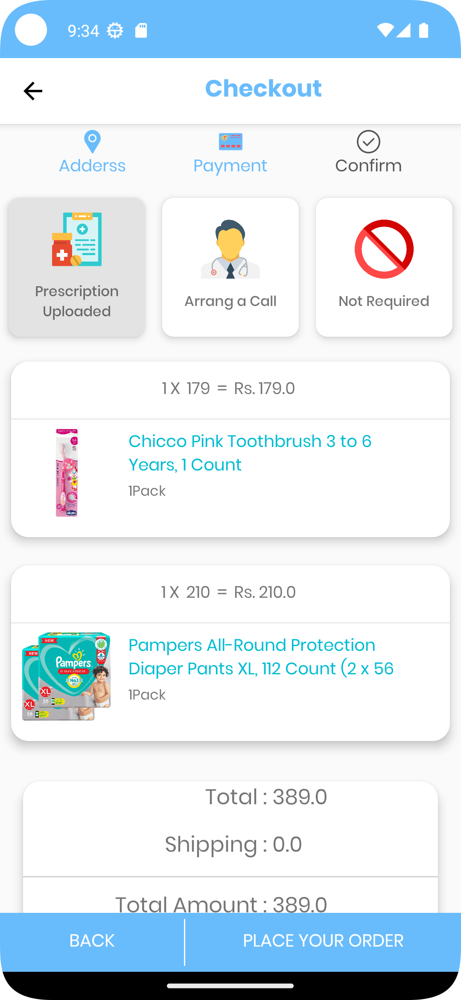|

| Order | Order Details | Prescription |
| ------ | ---- | ------ |
|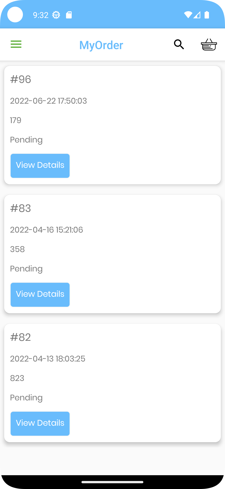|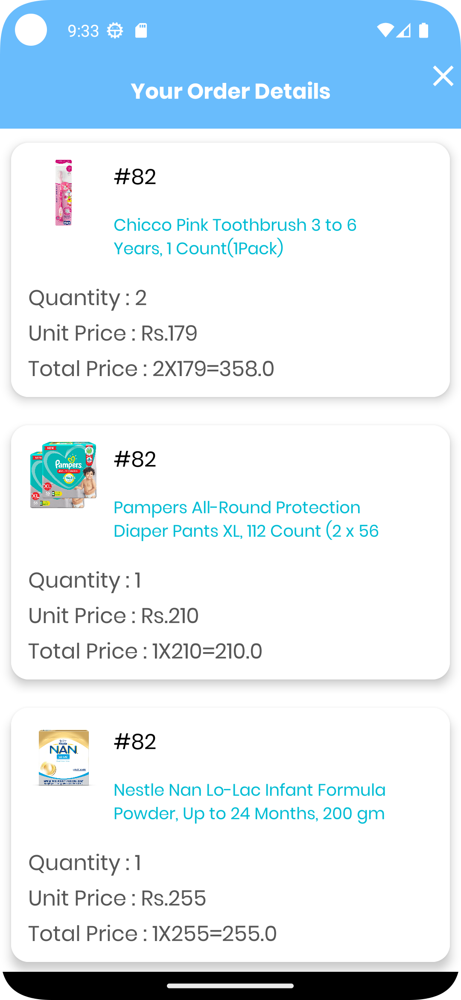|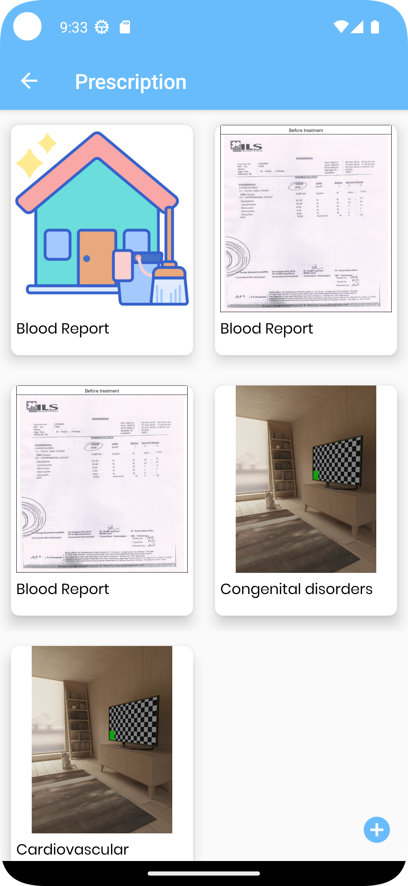|

## Permissions

On Android versions prior to Android 6.0, pharmrmacy android requires the following permissions:
- Full Network Access.
- Read and write access to external storage - To access prescription images
- Camera access - To capture image of prescription
- Receive sms - To access OTP code and verify automatically

## Contributing
You are free to use and modify the app.

## License

This application is released under GNU GPLv3 (see [LICENSE](LICENSE)).
Some of the used libraries are released under different licenses.
